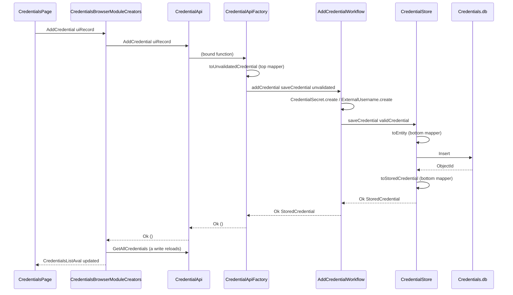
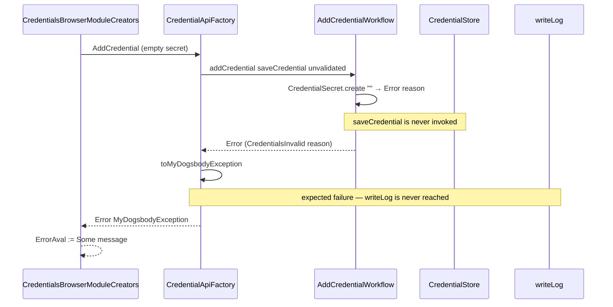
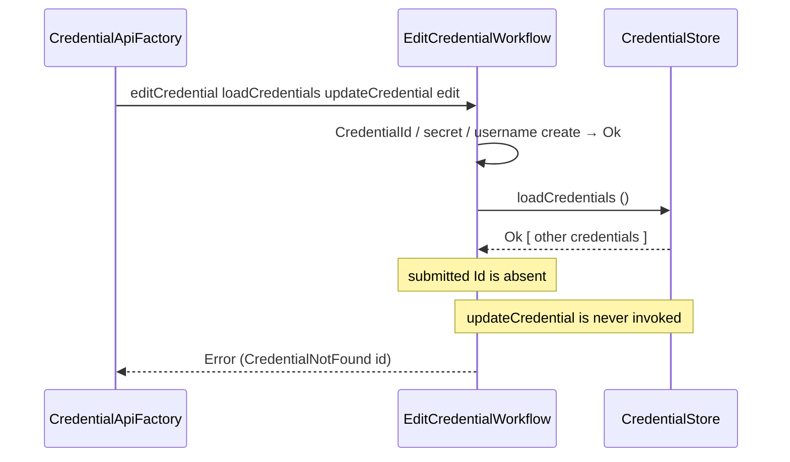

# Design — Architecture compliance

How the repository moves from the layered `Spine` chain to the functional onion described in
`CLAUDE-project.md` → *Architecture*. Requirements in [requirements.md](requirements.md).

## Gap analysis — what is non-compliant today

Verified against the working tree; every item cites the file that shows it.

| # | Rule in `CLAUDE-project.md` | Today |
| --- | --- | --- |
| 1 | `MyDogsbody.Domain` is the centre of everything | The project does not exist |
| 2 | `Spine` is retired | `Spine/UseCases/CredentialUseCases.fs` is the credentials path, and `Spine` is the only project pulling the integrations together |
| 3 | A store type never appears in a core signature | `Spine/Domains/CredentialsDomain.fs:11` takes `unit -> CredentialsCollection`, i.e. `ILiteCollection<Credential>`; `Spine/UseCases/CredentialUseCases.fs` does too |
| 4 | Two mappers, both at the edges | Five. `IntegrationCredentialUiTypeWithoutId` → `AddCredentialUseCaseTypeDto` → `AddCredentialDomainTypeDto` → `NewCredentialUseCaseTypeDto` → `NewCredentialRepositoryTypeDto` → `Credential`, with a mapper at every step. The read path mirrors it |
| 5 | A domain error DU per workflow area | `MyDogsbodyException` everywhere, including in the code that plays the domain's part |
| 6 | Constrained types with private constructors | None. `Credentials: string` and `ExternalUsername: string` travel raw from dialog to LiteDB |
| 7 | A type per pipeline stage | The five DTOs are the same shape repeated, not stages. Nothing distinguishes validated from unvalidated — nothing validates |
| 8 | Dependencies as function types | None. Modules call each other by name: `CredentialUseCases` → `CredentialsDomain` → `CredentialsUseCases` → `CredentialsRepository`. The only seam below the API factory is the collection getter |
| 9 | Domain workflows have no `ActionName` | The domain-shaped code carries one throughout |
| 10 | Line grouping is a domain decision | `Spine/Domains/DocumentDomian.fs` performs it inside a `handleError` block with an `ActionName` |
| 11 | Action strings mirror the code path and match their function | `ActionNames.MyDogsbody.Infrastructure.*` names a project that does not exist. Three modules — `MyDogsbody.Domains`, `MyDogsbody.UseCases`, `MyDogsbody.Repositories` — are wholly or partly dead |
| 12 | Action strings are asserted by contract tests | Not asserted, and two are already wrong — see *Latent defects* below |
| 13 | A logging repository and use case return `Result` | `ExceptionRepository.insertOne`/`getAll` and `ExceptionUseCases.addException`/`getAllExceptions` return `unit` and plain lists |
| 14 | All four test levels green | E2E has no harness. 28 tests cover the API factory, the top mappers, the module creator, `ReadPdfDomain` and `DocumentDomain`; the whole credentials chain below `Startup` — repository, use cases and four mapper modules — has no direct test, and neither does the logging store or any migration |

### Latent defects this change fixes en route

Found while reading `ActionNames.fs`; both are exactly the failure mode the contract-test rule
exists to catch, and both are invisible until someone reads the exception log.

- `UseCaseTypeMappers.mapAddCredentialUseCaseTypeDtoToAddCredentialDomainTypeDto` is bound to the
  string `…mapAddCredentialUseCaseTypeDtoToAddCredentialDomain` — truncated, so it does not name
  its own function.
- `UseCaseTypeMappers.mapCredentialDomainTypeDtosToCredentialUseCaseTypeDtos` reports the action
  `mapExistingCredentialUseCaseTypeDtoToCredentialDomainTypeDtos` — the opposite mapping.

Both live in code this change deletes, so they are fixed by removal; the contract test added in
Phase 6 is what stops them coming back.

### Behaviour that changes

Everything else in this change is structural. Three user-visible behaviours change, all agreed in
requirements.md → *Decisions taken*:

1. A credential with an empty secret or username is now rejected with a message, where it was
   previously stored.
2. Editing a credential targets the row by identifier. Previously `CredentialsRepository.updateOne`
   matched on `InfrastructureType`, so with two credentials sharing a type it updated the first.
3. Editing a credential that no longer exists now reports not-found. Previously it returned `Ok ()`
   silently.

Items 2 and 3 are pinned today by characterization tests in `CredentialApiFactoryTests`. Those two
tests are replaced — not deleted quietly — by tests asserting the new behaviour, in the same task.

## Specification conflicts found, and how they are resolved

Four places where `CLAUDE-project.md` cannot be satisfied literally. Each resolution is recorded
here so the deviation is a decision rather than a drift, and each becomes a documentation task.

**1. The domain cannot use `InfrastructureType`.** The enum lives in `MyDogsbody.Enums`, and the
domain may reference no project at all — the doc calls that "the invariant the architecture is
built on". So the domain declares its own `Infrastructure` DU and the two edge mappers translate.
This is a gain, not a tax: a DU matches the codebase's stated preference over an enum.

> **Corrected during implementation.** This section originally claimed *both* directions would be
> exhaustive matches, so a member added to one side and not the other would be a compile error.
> Only **domain → enum** is exhaustive. `InfrastructureType` is a C# enum and can hold any
> integer, so **enum → domain** cannot be proved exhaustive by the compiler: it returns `Result`
> and fails loudly on a value no build declared. The compile-time half is kept, and contract tests
> walk every declared member in both directions to catch a mismatch before production does.

*Rejected alternative:* letting `Unvalidated*` carry
the infrastructure as a plain `string` and parsing it in the domain, per the doc's stage table. It
would add a `CredentialError` case the UI can never trigger, since the value comes from a closed
dropdown, and it loses the compile-time check.

**2. A translated domain error still needs an action string.** The doc says domain workflows have
no `ActionName`, but `MyDogsbodyException` requires one. Resolved by naming the *API operation*
that failed — a new `ActionNames.MyDogsbody.Startup.CredentialApi` module — which is honest about
where the translation happened and keeps action strings out of the domain.

**3. The E2E logging assertion contradicts the no-Logging-reference rule.** The doc's E2E flow
wants "an `ExceptionLog` row lands in `Logging.db`", while its integration section says
`MyDogsbody.Tests` does not reference the logging project and never touches `Logging.db`. Resolved
by asserting through a recording `handleError` callback: `writeLog` is a lambda, so
`HandleErrorBuilder (fun ex -> recorded.Add ex)` proves a log was written without any logging
reference and without a file. `ReadPdfDomainTests` already uses this shape.

**4. `MyDogsbody.Tests` must reference `MyDogsbody.Logging` after all.** Requirement 13 changes the
logging repository and use cases, so the testing mandate requires tests for them, and the doc's own
integration section contemplates "LiteDB stores (each integration's, **and the log store**)" with a
fresh temp database per test. The narrower line — that tests never reference the logging project —
is a consequence of nothing needing to, and it stops being true here. Tests exercise the log store
against a temp file; nothing reaches `Logging.db` in the working directory.

## Target architecture

```
  MyDogsbody.Startup ──────────────────────────────────  composition root
      CredentialApiMappers.fs    domain ⇄ UI, CredentialError → MyDogsbodyException
      CredentialApiFactory.fs    adapters → dependency types, workflows applied
      Startup.fs                 handles, paths, registerServices
        │
        ├── outer ring
        │     Integrations.Credentials   CredentialStore.fs, CredentialEntityMappers.fs
        │     Integrations.Pdf           PdfDocumentReader.fs
        │     Logging                    ExceptionRepository, ExceptionUseCases (→ Result)
        │
        └── centre ── MyDogsbody.Domain ── references nothing
              Result.fs
              Credentials/  CredentialsTypes.fs
                            AddCredentialWorkflow.fs
                            EditCredentialWorkflow.fs
                            ListCredentialsWorkflow.fs
              Documents/    DocumentsTypes.fs
                            ReadDocumentLinesWorkflow.fs

  UI.Portal ── CredentialApi (UI.Types records) ── Startup
```

### Reference graph after the change

| Project | References |
| --- | --- |
| `MyDogsbody.Domain` | *(nothing)* |
| `Integrations.Credentials` | `Domain`, `Builders`, `Credentials.Database.Models`, LiteDB |
| `Integrations.Pdf` | `Domain`, `Builders`, PdfPig |
| `Startup` | `Domain`, both integrations, `Builders`, `Logging`, `UI.Types` |
| `UI.Types` | `Enums`, `Exceptions.Types` |
| `UI.Portal` | `UI.Types`, `Enums` |
| `Tests` | the above plus `Database`, `Database.Migrations`, bUnit |
| `Spine` | *deleted* |

`Domain` having no `ProjectReference` is what enforces the centre; a compliance test asserts the
`.fsproj` stays empty of them, because a reference added later would compile silently.

## Data models and interfaces

### `MyDogsbody.Domain/Credentials/CredentialsTypes.fs`

```fsharp
type Infrastructure =
    | Google
    | Microsoft

type CredentialSecret = private CredentialSecret of string
module CredentialSecret =
    let create (s: string) : Result<CredentialSecret, string> = ...   // rejects null/whitespace
    let value (CredentialSecret s) = s

type ExternalUsername = private ExternalUsername of string           // same shape
type CredentialId     = private CredentialId of string               // same shape

type UnvalidatedCredential =                 // what the dialog produced. untrusted
    { Infrastructure: Infrastructure; Credentials: string; ExternalUsername: string }

type UnvalidatedCredentialEdit =
    { Id: string; Infrastructure: Infrastructure; Credentials: string; ExternalUsername: string }

type ValidCredential =                       // been through validation
    { Infrastructure: Infrastructure; Credentials: CredentialSecret; ExternalUsername: ExternalUsername }

type ValidCredentialEdit =
    { Id: CredentialId; Infrastructure: Infrastructure; Credentials: CredentialSecret; ExternalUsername: ExternalUsername }

type StoredCredential =                      // been through the store
    { Id: CredentialId; Infrastructure: Infrastructure; Credentials: CredentialSecret; ExternalUsername: ExternalUsername }

type CredentialError =
    | CredentialsInvalid       of reason: string
    | ExternalUsernameInvalid  of reason: string
    | CredentialIdInvalid      of reason: string
    | CredentialNotFound       of CredentialId
    | CredentialStoreFailed    of message: string

type LoadCredentials  = unit               -> Result<StoredCredential list, CredentialError>
type SaveCredential   = ValidCredential    -> Result<StoredCredential, CredentialError>
type UpdateCredential = ValidCredentialEdit -> Result<StoredCredential option, CredentialError>
```

`ValidCredentialEdit` and `StoredCredential` are structurally identical today. They stay separate
types: one is an intent to write, the other is a fact read back, and collapsing them would let a
function that wants one accept the other — the defect the stage-type rule exists to prevent.

`UpdateCredential` returns `option` so *not found* stays a domain decision. The adapter reports
whether a row matched; `EditCredentialWorkflow` decides that no match means `CredentialNotFound`.

### `MyDogsbody.Domain/Documents/DocumentsTypes.fs`

```fsharp
type DocumentPath = private DocumentPath of string
module DocumentPath =
    let create (s: string) : Result<DocumentPath, string> = ...
    let value (DocumentPath p) = p

type Word = { Text: string; Bottom: float; Left: float }
type DocumentContent = { Words: Word list }

type DocumentError =
    | DocumentPathInvalid of reason: string
    | DocumentUnreadable  of message: string

type ReadDocumentContent = DocumentPath -> Result<DocumentContent, DocumentError>
```

A line is a plain `string`: there is no rule a `DocumentLine` type could carry, and a constrained
type that constrains nothing is noise.

### Workflows

```fsharp
AddCredentialWorkflow.addCredential
    : SaveCredential -> UnvalidatedCredential -> Result<StoredCredential, CredentialError>

EditCredentialWorkflow.editCredential
    : LoadCredentials -> UpdateCredential -> UnvalidatedCredentialEdit -> Result<StoredCredential, CredentialError>

ListCredentialsWorkflow.listCredentials
    : LoadCredentials -> unit -> Result<StoredCredential list, CredentialError>

ReadDocumentLinesWorkflow.readDocumentLines
    : ReadDocumentContent -> string -> Result<string list, DocumentError>
```

`listCredentials` is deliberately thin — it validates nothing and adds no rule. It exists so the
read path has the same shape as the write paths and so a future rule (hiding revoked credentials,
a defined sort order) has one place to land. The alternative, binding `LoadCredentials` straight to
the API record, would put a use case in the factory.

`editCredential` loads before it updates so the not-found decision is testable with lambdas. That
is a read-then-write with no transaction; for a single-user desktop app the race is accepted, and
recorded here rather than left implicit.

## Sequence diagrams

### Add credential — success



### Add credential — validation failure



### Edit credential — row no longer exists



## Error-handling approach

Two error types, meeting once, exactly as `CLAUDE-project.md` → *Errors* prescribes.

| Ring | Type | Builder | Logged? |
| --- | --- | --- | --- |
| Domain | `CredentialError` / `DocumentError` | `result` | never — the domain does not log |
| Outer ring | `MyDogsbodyException` | `handleError` | unexpected failures only |
| Composition root | translates both ways | — | no additional write |

**Inbound**, in `CredentialApiFactory`: an adapter's `MyDogsbodyException` becomes
`CredentialStoreFailed ex.Message`. The adapter has already logged it, so nothing logs again.

**Outbound**, in `CredentialApiMappers.toMyDogsbodyException`: each `CredentialError` case becomes a
`MyDogsbodyException` carrying the API-operation action and a message written from the case's
payload. This function is pure and lives with the mappers so a contract test can assert every case
without constructing a database.

The logging consequence falls out of the structure and needs no special handling: validation
failures are constructed directly and returned as `Error`, never passing through a `handleError`
block, so `writeLog` is never reached. Store failures pass through the adapter's `handleError`,
which logs once. That gives exactly the property requirements.md asks for — one log entry per
infrastructure failure, none per validation failure — and both are asserted.

`ExceptionRepository` and `ExceptionUseCases` change to return `Result<_, MyDogsbodyException>`.
`Startup.handleError`'s callback is the one place a `Result` is deliberately discarded: a failure to
write a log cannot itself be logged without recursing, and it must not displace the original
failure the caller is reporting. That single discard is commented at the call site. Returning
`Result` is still worth it — it is what lets the logging functions be tested at all.

## Testing strategy

### New and changed test files

| Level | File | Covers |
| --- | --- | --- |
| Unit | `Domain/ResultTests.fs` | `result` binds, short-circuits, is generic in its error type |
| Unit | `Domain/Credentials/CredentialsTypesTests.fs` | every `create`: accepted value, rejected value per rule, reason asserted |
| Unit | `Domain/Credentials/AddCredentialWorkflowTests.fs` | Ok every field; each validation error + payload; save never invoked on failure |
| Unit | `Domain/Credentials/EditCredentialWorkflowTests.fs` | Ok every field; `CredentialNotFound` with Id; update never invoked when absent or invalid |
| Unit | `Domain/Credentials/ListCredentialsWorkflowTests.fs` | Ok every field; empty list is Ok; store error propagated |
| Unit | `Domain/Documents/DocumentsTypesTests.fs` | `DocumentPath.create` |
| Unit | `Domain/Documents/ReadDocumentLinesWorkflowTests.fs` | the four grouping cases migrated from `DocumentDomainTests`; reader error; reader never invoked on invalid path |
| Unit | `Integrations/Pdf/PdfDocumentReaderTests.fs` | missing file → unlogged `ApplicationException`, action asserted |
| Unit | `Startup/CredentialApiMappersTests.fs` | domain ⇄ UI both directions, every field |
| Integration | `Integrations/Credentials/CredentialStoreTests.fs` | insert → read back; update by Id; update unknown Id → `Ok None`; two rows sharing a type |
| Integration | `Integrations/Credentials/CredentialsDatabaseContextModuleTests.fs` | the getter returns a usable collection against a temp file |
| Integration | `Integrations/Pdf/PdfDocumentReaderTests.fs` | corrupt file → logged failure; generated PDF → words with coordinates |
| Integration | `Logging/ExceptionStoreTests.fs` | insert → `getAll` round-trip against a temp log database; failure returns `Error` |
| Integration | `Startup/CredentialApiFactoryTests.fs` | rewritten: the real wiring against a temp database, both new behaviours |
| Integration | `Database/MigrationsTests.fs` | `MigrateUp` produces expected tables and columns; `Down` reverses |
| Contract | `Contracts/CredentialBoundaryMapperTests.fs` | both edge mappers field-for-field, both directions; `Username` → `ExternalUsername` asserted as a rename; constrained types survive the store's `string` column |
| Contract | `Contracts/CredentialDependencyContractTests.fs` | one shared suite over `LoadCredentials`, `SaveCredential`, `UpdateCredential`, run against the real adapter binding and every fake used in workflow tests |
| Contract | `Contracts/CredentialApiContractTests.fs` | one shared suite over `CredentialApi`, run against the real API and the fake the module-creator tests use |
| Contract | `Contracts/ErrorTranslationTests.fs` | every `CredentialError` case → intended action and message; adapter exception → intended domain case |
| Contract | `Contracts/ActionNamesTests.fs` | each outer-ring function's error reports its declared action |
| Contract | `Contracts/PersistedShapeTests.fs` | persisted field names for `Credential` and `ExceptionLog`; every `Infrastructure` member round-trips |
| Contract | `Contracts/DomainIsolationTests.fs` | `MyDogsbody.Domain.fsproj` declares no `ProjectReference` |
| E2E | `E2E/BlazorTestHarness.fs` | bUnit `TestContext` + MudBlazor services + Fun.Blazor rendering |
| E2E | `E2E/CredentialsFlowTests.fs` | add → row appears; edit → row updates; validation failure → alert and no log; store failure → alert and one log |

`Contracts/CredentialHopChainTests.fs` is deleted in the phase that deletes the hops. Its three
assertions do not vanish: the persisted field names and the `Username` rename move to
`PersistedShapeTests` and `CredentialBoundaryMapperTests`, and the every-infrastructure-type
round trip moves to `PersistedShapeTests`.

`Spine/Domains/DocumentDomainTests.fs` is deleted in the same phase as `Spine`; its four grouping
cases move to `ReadDocumentLinesWorkflowTests` and lose their `handleError` argument.

### The shared-suite shape

A dependency function type is a published interface, so its suite is a function over the
implementation rather than a fixture:

```fsharp
let loadCredentialsContract (name: string) (loadCredentials: LoadCredentials) = ...
```

run once against the adapter binding from `CredentialApiFactory` over a temp database, and once
against each lambda the workflow tests use. That is what stops a fake returning a shape the real
store never produces.

### Risk — the bUnit harness

This is the least certain task in the change and the one the previous change could not do.
MudBlazor components need `IDialogService`, the popover and dialog providers, and JS interop that
bUnit must stub. Fun.Blazor components are `ComponentBase`s, so rendering them is standard, but the
MudBlazor service wiring is fiddly and version-sensitive against Fun.Blazor.MudBlazor 8.13.0.

The harness is built first and proved against the smallest possible render — the credentials table
with a fake `CredentialApi` — before any flow test depends on it. If the MudBlazor services cannot
be made to render headlessly, the fallback is to drive the flows through the module creator and the
real factory, which covers everything except the rendered markup, and to record the shortfall in
the change description rather than claim the level. The requirement is not quietly downgraded: the
fallback is reported as an unmet level.

### Gate

`dotnet build MyDogsbody.sln` with zero errors, then
`dotnet test MyDogsbody.Tests\MyDogsbody.Tests.fsproj` with zero failures and zero skips. Each
phase in `tasks.md` ends at a green build so the migration is never left half-applied.
